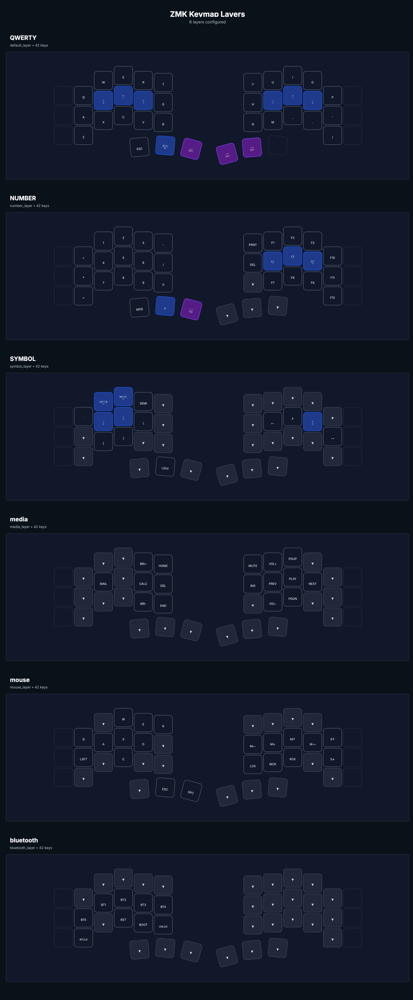

# Piantor Pro BT ZMK Configuration

ZMK firmware configuration for the Piantor Pro BT, a 36-key split ergonomic keyboard with wireless Bluetooth connectivity.

## Features

- **36-key split layout** with ergonomic column stagger
- **Bluetooth wireless** connectivity with profile switching
- **Home row mods** for efficient modifier access
- **6 layers** covering typing, numbers, symbols, media, mouse, and system functions
- **ZMK Studio support** for live keymap editing
- **Nice!View display** support
- **Automatic firmware builds** via GitHub Actions

## Layout Overview



### Base Layer (QWERTY)
```
| NONE |  Q  |  W  |  E  |  R  |  T  |  Y  |  U  |  I  |  O  |  P  | NONE |
| NONE |  A  |  S^ | D^  | F^  |  G  |  H  | J^  | K^  | L^  |  '  | NONE |
| NONE |  Z  |  X  |  C  |  V  |  B  |  N  |  M  |  ,  |  .  |  /  | NONE |
                   | ESC | LWR | SPC | ENT | RSE | NONE |
```
*^ = Home row mods (Shift/Ctrl/Alt)*

### Layer Access
- **Layer 1 (Numbers):** Hold Space
- **Layer 2 (Symbols):** Hold Enter
- **Layer 3 (Media):** Hold Backspace
- **Layer 4 (Mouse):** Tab when in Layer 1
- **Layer 5 (Bluetooth):** ; when in Layer 1

## Getting Firmware

### Automatic Builds
Firmware is automatically built when changes are pushed to the main branch. Download the latest firmware from the [Releases](../../releases) page.

### Manual Build Trigger
You can manually trigger a build by going to the [Actions](../../actions) tab and running the "Build ZMK firmware" workflow.

## Installation

1. Download the appropriate `.uf2` file from the latest release
2. Put your keyboard into bootloader mode
3. Copy the `.uf2` file to the mounted drive
4. The keyboard will automatically reboot with the new firmware

## Configuration

### ZMK Studio
This configuration includes ZMK Studio support for live keymap editing:
1. Use a Studio-enabled firmware build
2. Connect via USB
3. Open [ZMK Studio](https://zmk.dev/docs/features/studio) in your browser

### Bluetooth Profiles
- **Profile 0-4:** Access via Layer 5 (Bluetooth layer)
- **Clear all profiles:** BT_CLR on Layer 5
- **Profile switching:** BT_SEL 0-4 on Layer 5

### Display Support
Nice!View displays show:
- Current layer name
- Bluetooth connection status
- Battery level (when supported)

## Customization

### Modifying the Keymap
1. Edit `config/piantor_pro_bt.keymap`
2. Commit and push changes
3. Download new firmware from Actions or Releases

### Key Features to Preserve
- **Balanced mod-tap** with 200ms timing and retro-tap enabled
- **Home row mods** on ASDF/JKL; positions following GACS order
- **Layer organization** for consistent navigation
- **Super macro** for Ctrl+Alt+Cmd app-switching

### Build Variants
The configuration builds multiple variants:
- **Standard builds:** With Nice!View support
- **Settings reset:** For clearing EEPROM
- **Studio-enabled:** For live editing support

## Troubleshooting

### Reset to Defaults
1. Use the settings_reset firmware variant
2. Flash to both halves
3. Flash back to normal firmware

### Bootloader Access
- **Layer 5:** Has bootloader key for emergency access
- **Physical reset:** Use reset button if available

### Common Issues
- **Unresponsive keys:** Try settings reset firmware
- **Bluetooth pairing:** Clear profiles and re-pair
- **Split sync issues:** Re-flash both halves

## Technical Details

- **Firmware:** ZMK (Zephyr RTOS)
- **MCU:** nRF52840 (Bluetooth LE)
- **Layout:** 36 keys in 3x5+3 configuration
- **Connectivity:** Bluetooth 5.0, USB-C
- **Display:** Nice!View compatible
- **Power:** Battery powered with low-power design

## Resources

- [ZMK Documentation](https://zmk.dev/)
- [Piantor Keyboard](https://github.com/beekeeb/piantor)
- [ZMK Studio](https://zmk.dev/docs/features/studio)
- [Nice!View Display](https://nicekeyboards.com/docs/nice-view/)

## License

This configuration is based on the ZMK firmware project and follows the MIT license.
